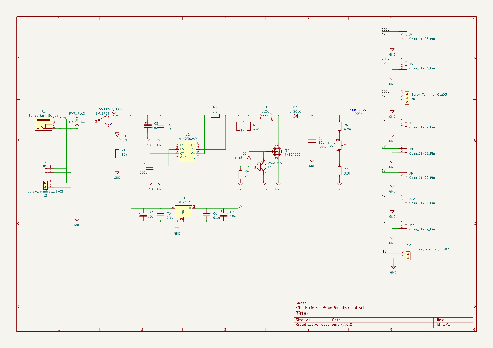
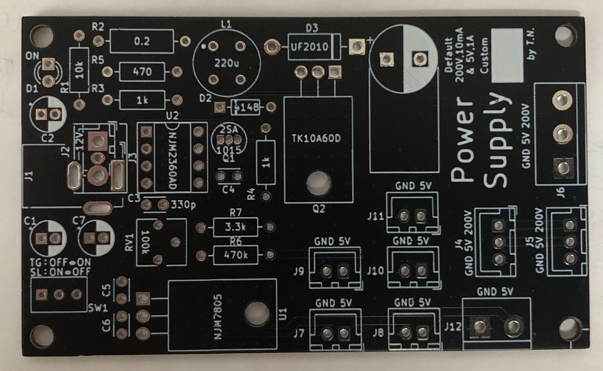
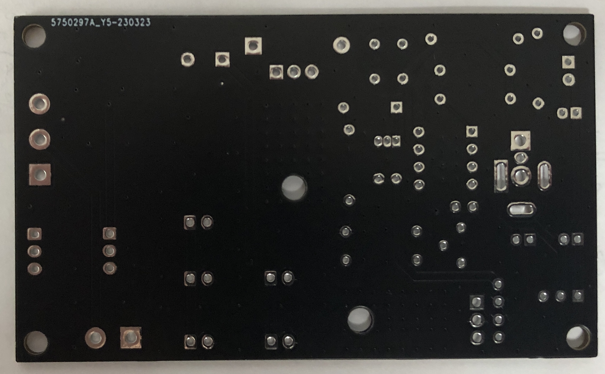

# NixieTubePowerSupply

## 概要

* ニキシー管用の高電圧と制御用の電圧を生成する電源回路基板
* デフォルトでは200Vと5Vを生成
* 5Vだけとしても利用可能
* パーツを変えることで他の電圧ようにも流用可

## 回路図

## 外観

* 表
  
    

* 裏

    

## その他

* 高電圧注意
* 一応手元で動きましたが，動作保証はできません